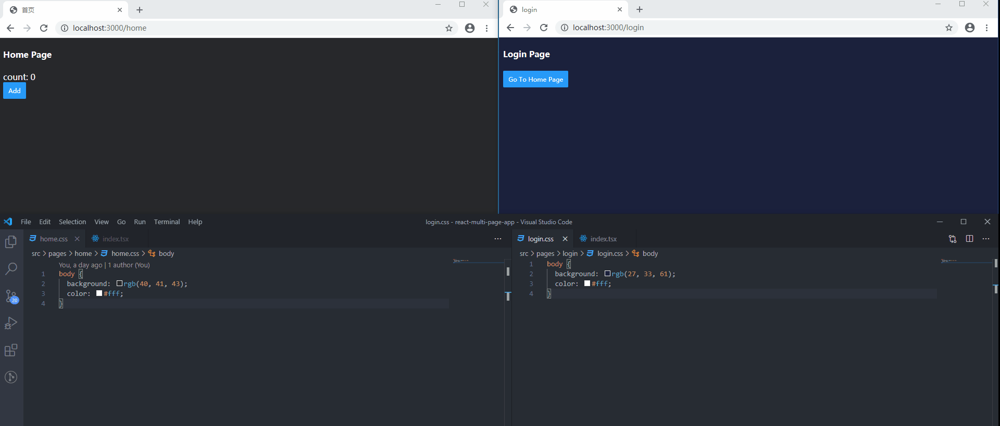
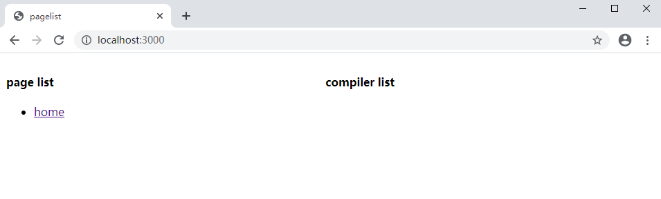
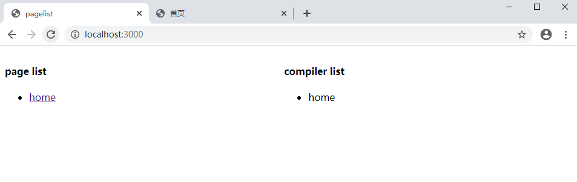
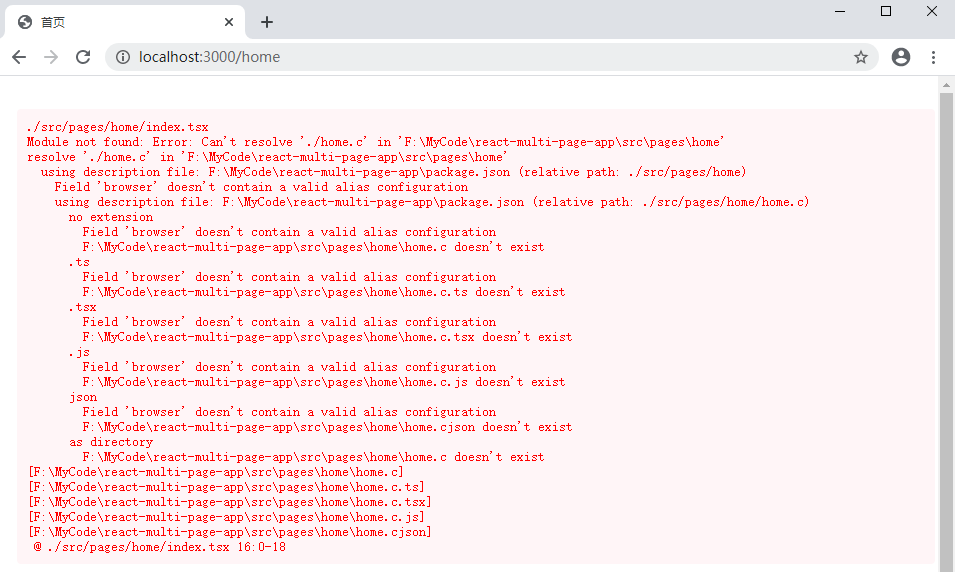

# react-multi-page-app
这是一个简单的react+typescript多页应用开发脚手架。 使用webpack搭建，完成了基础功能。



# src目录结构
```
src
├─pages # 页面目录（不可重命名）
│  │  Home  # 首页
│  │  PageA # 页面A      
│  │  PageB         
│  └─ PageC
|       index.tsx #页面入口
|       pageInfo.json #页面配置信息
├─Component   # 页面共享组件库
|  |  Button  # 按钮组件
|  |  Header
|  |  Footer
│  ...
├─ComponentLibA # 页面共享组件库A
├─ComponentLibB   
├─ComponentLibC
...
```
# 启动
```bash
npm install

npm start
```
在浏览器打开`http://localhost:3000`你会看到如下的页面。



左侧是页面列表，一个列表项对应`src/pages`下的一个文件夹。点击可以打开页面。右侧是已经创建并运行的编译器的列表，一个编译器对应一个页面。在一个新的标签打开`http://localhost:3000/home`就会启动home页面的编译器，再刷新`http://localhost:3000`页面就能看到右侧列表就会有一个home项。



如果关掉`http://localhost:3000/home`标签页，过一段时间（最长30秒）再刷新`http://localhost:3000`就会看到compiler list又变为空了，这时home页面的编译器已经被停止并清除。如果重新打开home页面就又能重新创建编译器。

# 添加一个页面
```bash
npm run addPage <pagename> 
```
比如我们创建一个登录页，执行命令`npm run addPage login`之后就能在`src/pages`下看到一个login文件夹。login文件夹下会有两个文件，`index.tsx`入口文件和 `pageInfo.json`页面信息json。`pageInfo.json`中的信息会被嵌入html。
```json
{
  "title": "login",  //页面title
  "description": "", // 页面描述
  "keywords": []     //页面关键词
}
```
这时可以刷新`http://localhost:3000`页面从login入口打开页面，或者直接在浏览器地址栏输入`http://localhost:3000/login`打开页面。然后可以对`src/pages/login/index.tsx`中的内容修改，保存修改后浏览器会自动刷新页面。

# 静态资源
在你项目中使用的http静态资源可以放在`public`文件夹下。

# 编译报错提示
在webpack的编译过程中发生的错误都会在浏览器端输出。




# 构建
```bash
npm run build
```
打包好的内容会输出到`dist`目录下。

# 注意
这个脚手架并不是特别完善，功能还是很~~简单~~简陋的，webpack的loader和plugin都配置得很简单。报错提示等功能也不完善。（意思就是是不建议你使用🤣）
